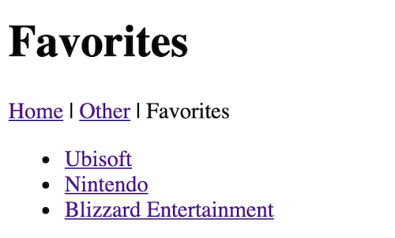

# Express Handlebars Demo

## I. Overview

- Handlebars works similar to Vue.js (330), *except* the rendering is happening on the server-side instead of the client-side
- Today's start code was adapted from here:
  - https://github.com/ericf/express-handlebars

## II. Handlebars Reference

- handlebars:
  - https://handlebarsjs.com
  - https://www.npmjs.com/package/express-handlebars
  - https://github.com/ericf/express-handlebars
- express:
  - https://www.npmjs.com/package/express
  - https://expressjs.com/en/api.html

## III. Demo & HW

1) Grab the [**basic-handlebars-start.zip**](_files/basic-handlebars-start.zip) file

2) Watch these 2 videos:

    - [Handlebars -1 (12:42)](https://video.rit.edu/hapi/v1/contents/permalinks/430-handlebars-1/view)
    - [Handlebars -2 (06:37)](https://video.rit.edu/hapi/v1/contents/permalinks/430-handlebars-2/view)

3) Modify **server.js** to point at a "/favorites" page

4) In the **views/** folder, create **favorites.handlebars**, and on it:

    - add links to the "other" and "home" pages
    - give it a `pageTitle` inside of a `<h1></h1>`
    - render a `<ul>` list of hypertext links that point at some game companies - the data is in this format:
  
  ```js
  [
    {"name": "Ubisoft", "url": "https://www.ubisoft.com" }, 
    ...
  ]
  ```

5) In **server.js**, pass in such an array, there should be data for at least 3 game companies in it

6) modify **home.handlebars** and **other.handlebars** to have a link to "favorites"

7) When you are done, ZIP and POST the done folder to the myCourse dropbox

<hr>

**Completed Example:**


